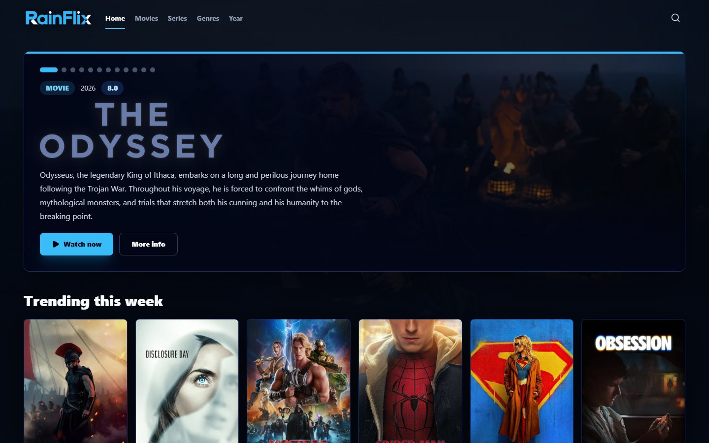

<p align="center">
  
</p>

<h1 align="center">RainFlix</h1>

<p align="center">
  <strong>A cinematic, touch-first movie and series discovery experience.</strong>
</p>

<p align="center">
  <a href="https://kaaanooon.github.io/RainFlix/"><strong>Open RainFlix</strong></a>
  |
  <a href="#features">Features</a>
  |
  <a href="#quick-start">Quick Start</a>
  |
  <a href="#deployment">Deployment</a>
</p>

<p align="center">
  <a href="https://github.com/kaaanooon/RainFlix/actions/workflows/deploy.yml">
    
  </a>
  
  
  
  
</p>

<a href="https://kaaanooon.github.io/RainFlix/">
  
</a>

RainFlix is a responsive React interface for exploring movies and television
series through live TMDB data. It combines fast catalog browsing with cinematic
motion, shared title pages, flexible embedded players, and navigation that
works across phones, desktops, keyboards, and TV remotes.

The entire application builds to static files, so it can run on GitHub Pages
without an application server.

## Features

| Experience                    | Highlights                                                                                                                        |
| ----------------------------- | --------------------------------------------------------------------------------------------------------------------------------- |
| **Cinematic discovery**       | Home, Movies, Series, Genre, and Year views powered by current TMDB feeds                                                         |
| **Gesture-driven hero**       | A diagonal peel transition that follows the pointer while swiping, settles naturally on release, and crossfades the page backdrop |
| **Rich title pages**          | Shareable title URLs with synopsis, cast, genres, runtime, status, rating, title logos, and fullscreen trailers                   |
| **History-aware navigation**  | Browser Back closes fullscreen playback; Forward never restarts a stream automatically                                            |
| **Personal library**          | Device-local My List bookmarks and Continue Watching links that remember the selected season and episode                          |
| **Focused search**            | A dedicated, shareable search view with type, genre, and year filters                                                             |
| **Flexible playback**         | Compact provider and torrent-mode selectors, remembered preferences, fullscreen support, and movie or episode-specific embeds     |
| **Series navigation**         | Season and episode selection with episode metadata and direct watch URLs                                                          |
| **More to discover**          | Similar titles, expandable browse grids, newest releases, trending titles, search, and filters                                    |
| **Responsive and accessible** | Mobile navigation drawer, keyboard focus management, reduced-motion support, semantic dialogs, and remote-control key handling    |
| **Fast repeat visits**        | Responsive TMDB artwork plus bounded caching for metadata, title logos, loader posters, and player preferences                    |
| **Installable static app**    | A lightweight service worker caches RainFlix assets and catalog artwork without touching third-party player requests              |
| **Resilient interface**       | Retry states plus a last-resort recovery screen that preserves saved titles and viewing history                                   |

## Tech Stack

- [React 19](https://react.dev/) for the interface and state
- [React Router](https://reactrouter.com/) with hash routing for static hosting
- [Vite 8](https://vite.dev/) for development and production builds
- [Tailwind CSS 3](https://tailwindcss.com/) plus focused custom animation styles
- [Lucide React](https://lucide.dev/) for interface icons
- [TMDB API](https://developer.themoviedb.org/docs/getting-started) for movie and series metadata
- [WebTorrent](https://webtorrent.io/) for optional in-browser WebRTC torrent playback
- GitHub Actions and GitHub Pages for continuous deployment

## Quick Start

### Requirements

- Node.js `22.22.0` or newer
- npm
- A TMDB API key intended for browser use

### Install and run

```bash
git clone https://github.com/kaaanooon/RainFlix.git
cd RainFlix
npm ci
npm run dev
```

Open the local URL printed by Vite, normally
[`http://localhost:5173`](http://localhost:5173).

### Production build

```bash
npm run build
npm run preview
```

Vite writes the deployable application to `dist/`.

## Configuration

Runtime settings live in [`scripts/config.js`](scripts/config.js).

Linked configuration and development notes for Obsidian are in
[`docs/obsidian/`](docs/obsidian/README.md), including the
[Yastream setup](docs/obsidian/Yastream.md) and
[Torrentio setup](docs/obsidian/Torrentio.md).

```js
window.RAINFLIX_CONFIG = {
  tmdbApiKey: "YOUR_TMDB_V3_API_KEY",
  tmdbRegion: "US",
  tmdbCacheTtlMs: 900000,
  analyticsScriptUrl: "",
  analyticsWebsiteId: "",
  analyticsDomains: "",
  // Player base URLs...
};
```

The configuration controls:

- TMDB API, image, and regional settings
- Cache lifetime and maximum stored entries
- Initial loader timing and fallback timeout
- Optional Umami-compatible analytics; it stays disabled while its fields are empty and respects Do Not Track
- Base URLs for VidSrc, 2embed, MultiEmbed, VidLink, VidFast, VidSrcMe, and VidCore

RainFlix is a static client application. Every value placed in
`scripts/config.js` is included in the browser bundle and can be inspected by
visitors. Do not place private client secrets or server credentials there.

## Routes

Hash routing keeps every view compatible with GitHub Pages and other static
hosts without rewrite rules.

```text
#/home
#/movies
#/series
#/genre/action
#/year/2025
#/library
#/search?q=batman&type=movie&year=2022
#/title/movie/533535
#/title/tv/1399?season=1&episode=1
```

Title URLs open directly. Old watch and preview links redirect to the shared title page.

## Project Structure

```text
RainFlix/
|-- assets/                     Brand and README imagery
|-- public/                     PWA manifest, service worker, and install assets
|-- scripts/
|   |-- config.js               Public runtime configuration
|   `-- rainflix-api.js         TMDB data, caching, and embed URL builders
|-- src/
|   |-- components/             Header, cards, carousel, loader, and player
|   |-- hooks/                  Remote and keyboard navigation
|   |-- pages/                  Catalog, search, library, and title experiences
|   |-- App.jsx                 Routes and application shell
|   `-- main.jsx                React entry point
|-- tests/                      Playwright browser smoke tests
|-- styles/input.css            Tailwind layers and custom motion
|-- .github/workflows/          Deployment and quality checks
`-- vite.config.js
```

## Deployment

RainFlix includes a GitHub Pages workflow that installs dependencies, builds
the Vite project, uploads `dist/`, and deploys the resulting artifact.

1. Open the repository's **Settings > Pages**.
2. Set **Source** to **GitHub Actions**.
3. Push to `main`, or run **Deploy RainFlix to GitHub Pages** manually from the Actions tab.
4. Wait for both workflow jobs to complete successfully.

`vite.config.js` automatically applies the repository base path during GitHub
Actions builds, so generated assets load correctly from `/RainFlix/`.

## Playback Notes

RainFlix does not host or proxy video files. Shared title pages list configured
iframe players and installed add-ons beside the details. Clicking a player opens
fullscreen playback. Add-ons with multiple streams show source choices first;
a single playable source opens immediately after the provider lookup.
Yastream and Torrentio remain optional adapters, disabled by default.
Torrentio is also available: direct HTTP(S) sources use the native player,
while torrent sources offer three manual modes. Browser WebTorrent is the
default pure-static option and reaches WebRTC peers only. An existing
[Stremio Service](docs/obsidian/Stremio%20Service.md) at
`http://127.0.0.1:11470` can handle conventional torrent swarms, and External
mode keeps magnet links available. Browser codec and network restrictions still
apply. A source click or the sole result of an explicit provider click authorizes
transfer; opening a title or changing service settings does not.
Availability, regional access, media CORS, and codec support depend on the
provider and browser. See the [playback notes](docs/obsidian/Title%20Playback.md) for
configuration, subtitles, and limitations.

Use only providers and media for which you have the necessary rights, and
review each provider's terms before deploying a public instance.

## Contributing

1. Fork the repository and create a focused branch.
2. Make the change using the existing component and styling patterns.
3. Run `npm run check` and `npm run test:e2e`.
4. Open a pull request with a short description and screenshots for visual changes.

Bug reports and ideas are welcome in
[GitHub Issues](https://github.com/kaaanooon/RainFlix/issues).

## Acknowledgements

Movie and television metadata and artwork are provided by
[The Movie Database](https://www.themoviedb.org/).

This product uses the TMDB API but is not endorsed or certified by TMDB.

RainFlix is an independent project and is not affiliated with any organization.
